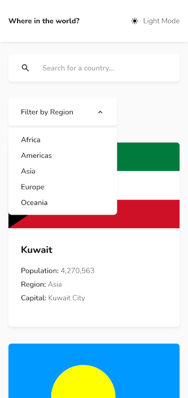

# Frontend Mentor - REST Countries API with color theme switcher solution

This is a solution to the [REST Countries API with color theme switcher challenge on Frontend Mentor](https://www.frontendmentor.io/challenges/rest-countries-api-with-color-theme-switcher-5cacc469fec04111f7b848ca).

## Table of contents

- [Overview](#overview)
  - [The challenge](#the-challenge)
  - [Screenshot](#screenshot)
  - [Links](#links)
- [My process](#my-process)
  - [Built with](#built-with)
  - [What I learned](#what-i-learned)
  - [Continued development](#continued-development)
  - [Useful resources](#useful-resources)
- [Author](#author)

## Overview

### The challenge

Users should be able to:

- See all countries from the API on the homepage
- Search for a country using an `input` field
- Filter countries by region
- Click on a country to see more detailed information on a separate page
- Click through to the border countries on the detail page
- Toggle the color scheme between light and dark mode _(optional)_

### Screenshot




### Links

- Solution URL: [Go to solution](https://www.frontendmentor.io/solutions/rest-countries-api-w-svelkit-ts-tailwind-axios-and-ssr-prefetching-i4wDMW6EGE)
- Live Site URL: [Go to live site](https://rest-countries-api-seven-taupe.vercel.app/)

## My process

### Built with

- Semantic HTML5 markup
- Flexbox
- CSS Grid
- Mobile-first workflow
- [LocalStorage](https://developer.mozilla.org/fr/docs/Web/API/Window/localStorage) - Save data on the browser
- [SvelteKit](https://kit.svelte.dev/) - JS framework w/ SSR (Server-Side Rendering)
- [TailwindCss](https://tailwindcss.com/) - Utility-first CSS framework
- [Typescript](https://www.typescriptlang.org/) - Strongly typed JS
- [Axios](https://axios-http.com/fr/docs/api_intro) - HTTP Promise based client for browsers & node.js.

### What I learned

#### Debounce function

I use this methods to make sure the name filter (from the search input) is not updated on every keypress of the user.

function definition:

```ts
export const debounce = (callback: (props: any) => void, delay: number = 750) => {
  let timeout: ReturnType<typeof setTimeout>;
  return (...props: any) => {
    clearTimeout(timeout);
    timeout = setTimeout(() => {
      callback(props);
    }, delay);
  };
};
```

Then in the component:

```ts
let value: string = $filters.name; // This is the value of the input

const onChange = debounce(() => updateFilter("name", value.trim()), 250); // Runs only if user stops typing for 250ms
$: value && onChange(); // the $: makes sure onChange is called everytime "value" changes
```

#### Prefers Color Scheme

Get the color scheme from the user settings in the browser:

```ts
const getPreferedColorScheme = (): ThemeMode => {
  return window.matchMedia("(prefers-color-scheme: dark)").matches ? "dark" : "light";
};

export const getInitialTheme = (defaultValue: ThemeMode): ThemeStore => {
  if (!browser) return { mode: defaultValue, prefersColorScheme: true };
  const json = window.localStorage.getItem("theme");

  if (json === null) return { mode: getPreferedColorScheme(), prefersColorScheme: true };

  const storedTheme = JSON.parse(json) as ThemeStore;
  const mode = storedTheme.prefersColorScheme ? getPreferedColorScheme() : storedTheme.mode;
  return { ...storedTheme, mode };
};
```

#### Object.values | Object.keys | Object.entries

Use these to loop on a JavaScript object like it is an Array

```ts
Object.values(data.currencies).forEach((currency) => {
  props.currencies = props.currencies.concat((currency as any).name, " ");
});
```

#### $app/store --> navigating

A readable reactive variable that can be used to track is the app is navigating between two endpoints.

I used it to show a loading overlay when fetching a country in the app:

```ts
import { navigating } from "$app/stores";
$: showOverlay = $navigating !== null; // If true --> Show the loading indicator
```

#### $lib alias

Use src/lib/\* to prevent using absolute paths for imports

When using Typescript you need to declare the path in your tsconfig:

```json
{
  "extends": "./.svelte-kit/tsconfig.json",
  "compilerOptions": {
    "allowJs": true,
    "checkJs": true,
    "esModuleInterop": true,
    "forceConsistentCasingInFileNames": true,
    "resolveJsonModule": true,
    "skipLibCheck": true,
    "sourceMap": true,
    "strict": true,
    // If you want to change is from src/lib you'll need to update your svelte.config file.
    "paths": {
      "$lib": ["src/lib"],
      "$lib/*": ["src/lib/*"]
    }
  }
}
```

Then your imports look like this:

```ts
import SearchInput from "$lib/components/SearchInput.svelte";
import RegionSelect from "$lib/components/RegionSelect.svelte";
import CountryCard from "$lib/components/CountryCard.svelte";
import type { CountrySimple } from "$lib/types";
import { filterCountries } from "$lib/helpers";
import { filters } from "$lib/stores";
```

### Continued development

I want to implement a service worker to cache the already fetched endpoint for each individual country.

E.g. `https://my-url/countries/[name]`

This way pages would load faster and the Open Source API owners would appreciate the fewer requests.

### Useful resources

- [Heroicons](https://heroicons.com/) - Beautiful hand-crafted SVG icons, by the makers of Tailwind CSS.
- [Phosphoricons](https://phosphoricons.com/) - Flexible icon family for interfaces, diagrams, presentations, etc...

## Author

- Frontend Mentor - [@AntoineC-dev](https://www.frontendmentor.io/profile/AntoineC-dev)
